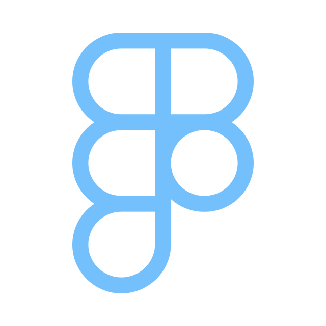

 <h1 align="center"> Olá, seja bem-vindo!</h1>
 
 Meu nome é **Isabelly dos Reis Santos**, tenho **17 anos** e atualmente curso o **Ensino Médio Técnico Integrado em Informática para a Internet** no **Marista Escola Social Irmão Acácio**.  
Tenho muito interesse na área de **informática** e estou sempre buscando aprender novas tecnologias e melhorar minhas habilidades.

____________________________________________________________________________________________________________________________________________________________________________________________________________________
### Projetos em Destaque
- **Página de Cadastro** → [Ver Projeto]()  
- **Relógio Digital** → [Ver Projeto]()

____________________________________________________________________________________________________________________________________________________________________________________________________________________

### Habilidades e Tecnologias

|Tecnologia / Ferramenta|            Nível                  |
|-----------------------|-----------------------------------|
| **Design**            | Habilidade em desenvolvimento     |
| **Figma**             | Habilidade em desenvolvimento     |
| **JavaScript**        | Habilidade em desenvolvimento     |
|**Aprendizado rápido** | Facilidade em aprender tecnologia |

__________________________________________________________________________________________________________________________________________________________________________________________________________________

### Redes sociais e contato 

  

   

